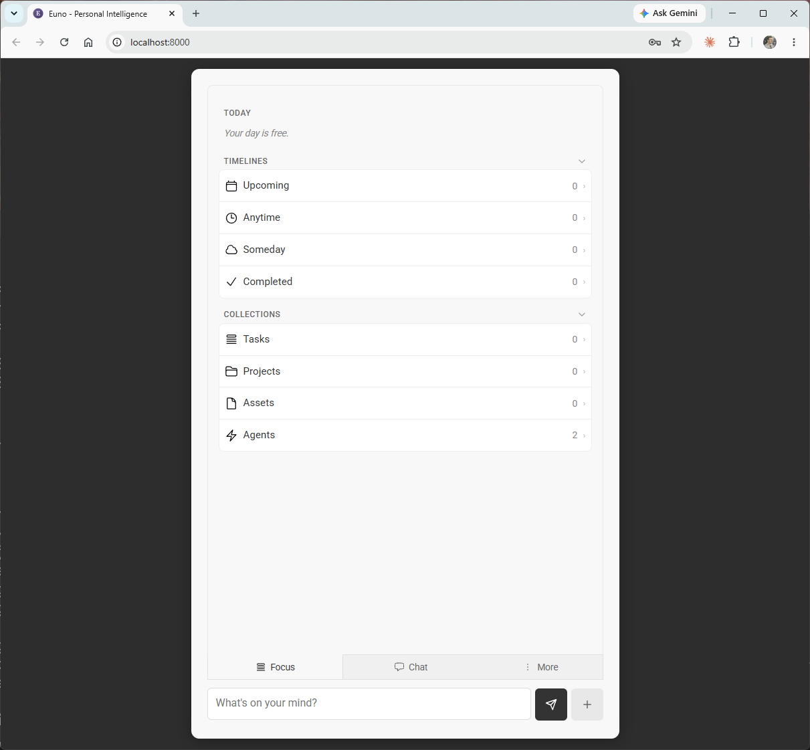
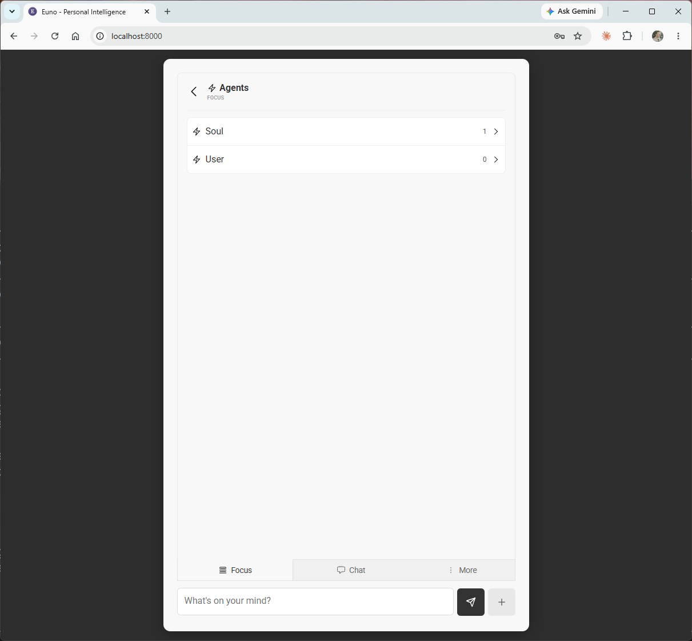
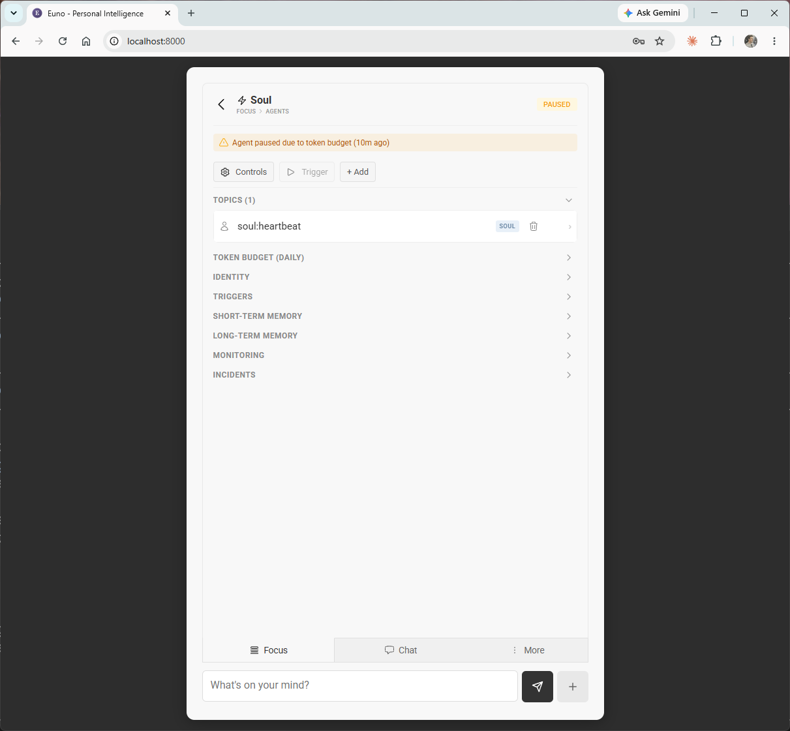

# Focus

## Key Ideas

- **Focus, Not Chat, Is First-Class**: for people, the primary interface is *Focus*—a curated view of what matters now. Chat is one input; Focus is the product.
- **Managed Attention Is The Point**: Focus exists to solve cognitive overload. It shows the few things worth attention and keeps everything else quiet.
- **Ambient And Anticipatory**: Focus surfaces what matters before a person asks, with smart defaults and no friction.
- **A Window Into The Fleet**: from Focus a person can see and steer their agents—identity, memory, triggers, budgets, incidents—because the agents serving them are part of what matters.
- **Calm By Design**: the interface is quiet and uncluttered. (The screenshots are intentionally grayscale—color was a deliberately deferred decision, not the design.)

## Purpose

Focus is Euda's answer to the life problem it set out to solve: distraction, overload, and algorithmic capture. Where most software competes for attention, Focus *guards* it. It is the first-class human surface precisely because attention—not chat throughput—is the scarce resource Euda is trying to protect.

A person opens Focus to see what matters today, not to be greeted by an empty prompt demanding input. The chat box is present as one way to add to the system, but the center of gravity is the curated view: today, the things in motion, and the agents tending to them.

## The Surface

Focus opens on **Today** and a calm summary of what is in motion. From there it expands into:

- **Timelines** — work organized by time: *Upcoming*, *Anytime*, *Someday*, and *Completed*.
- **Collections** — the things Euda is tending: *Tasks*, *Projects*, *Assets*, and *Agents*.

Expanded, Timelines and Collections reveal the structure beneath the calm surface—work sorted by when it matters and by what kind of thing it is:

Because agents are part of what matters, Focus is also where a person meets their fleet. Opening **Agents** lists the intelligences serving them—here, *Soul* and *User*—the AI persona and the person, modeled side by side as agents:

Opening an agent reveals the whole of it: its topics, token budget, identity, triggers, short-term and long-term memory, monitoring, and incidents—and its state, plainly shown. Here Soul is `PAUSED`, with the reason visible ("Agent paused due to token budget") and the path to resume:

This screen makes Euda's principles concrete: the four parts of an agent are all here (identity, cognition's self-regulation via budget and monitoring, memory, behavior via triggers and topics), the user appears in the same list as the AI agent, and self-regulation is visible rather than hidden.

## Expected Role

Focus should be the calm control room a person returns to:

- lead with what matters now; keep the rest quiet;
- present work through Timelines and Collections rather than as an undifferentiated list;
- give a person a clear window into each agent—who it is, what it is doing, what it costs, and when it stopped;
- act with smart defaults and instant feedback, minimizing the thinking and clicking a person must do.

Current implementation details that matter to intent:

- `v1` delivers Focus as a mobile-first, single-column browser app with stacked navigation (back buttons, not nested modals), with tabs for Focus, Chat, and more.
- The interface is intentionally minimal and, in these screenshots, grayscale—color decisions were deliberately deferred so the structure could be judged on its own.

Focus should not drift back toward a chat-first or feed-first design. The whole point is that the curated view leads and the conversation is secondary.

## Future Direction

Focus is the browser expression of a more ambient idea. The same principle—surface the few things that matter, keep the rest quiet—should carry to HUDs in the flow of life, voice on wearables, and smart-device displays. The screen is one rendering of Focus, not its final form.

The intent to preserve: a person's primary experience of Euda is managed attention—what matters now, surfaced calmly—wherever that experience eventually lives.
